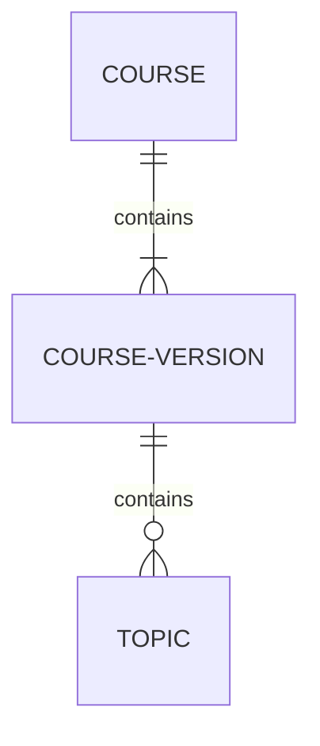
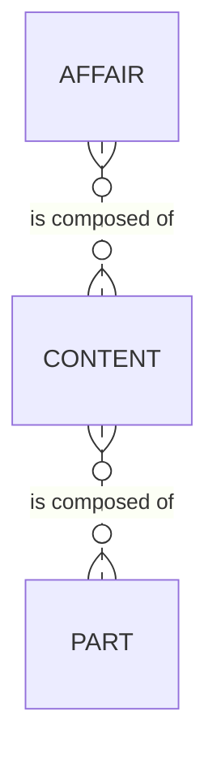

<script src="https://cdn.jsdelivr.net/npm/mermaid/dist/mermaid.min.js"></script>

[TOC]

# Knowledge structure

## Introduction

In order to facilitate the management of contents by Humane, three knowledge structures will be used. The first one is an hierarchy detailing the different components of a course. An hierarchy implies ownership: the level below is comprised on the upper levels. The second structure has no hierarchical links, but represents materials used to build the courses: contents and parts. The third structure serves to group other objects. Two types of groups will be used: themes and paths.

In the next sections all objects will be detailed to the data dictionary level.

## Objects description

**Attributes shared by all objetcs:**

- Status: it allows for the object life cycle management. No object is ever deleted.
	- Value: it identifies the current status. The values are restrained by a value list. The value is automatically defined based on the available status dates.
	- Creation date: date when the object was created.
	- Testing start date: date when the object started the testing phase.
	- Activation date: date when the object was released to use.
	- Retirement date: date when the object was retired.
- Detailed description: It allows for an in depth description of the object.
- Specific: When the object is specific for a client, this attribute will show the client name.

**Hierarchy:**

- Level 1 Courses: São subdivisões de um tema. Os cursos podem ser gerados por: métodos distintos para realizar o mesmo processo (ex. picking de caixa na posição palete por pedido cliente ), implementações distintas pelos clientes de um mesmo process (ex. picking unitário na L'Oréal), especificidades de um tipo de mercadoria (ex. segurança no transporte de explosivos), necessidades específicas de uma população (ex.: iniciante, avançado). Um curso pode ter antecessores obrigatórios, criando um currículo. Para tanto, basta informar as variantes antecessoras na coluna "Dependência". Essa informação será utilizada no LMS. Can be updated after passing into "active" status if the change is minor. Otherwise, a new course must be created.
	- ID: It identifies each object individually and is defined automatically by the system.
	- Name: it is used by all systems when showing the object.
	- ThemeID: The ID of the affair.
	- Dependencies: CourseID of courses that are pre-requisites to this one. When multiple values, use comma as separator.
	- Category: Indicates the reason for the course existence. It is constrained by a value list.
- Level 2 Courses versions: . After passing into status "active", versions can not be changed. Instead, a new version must be created. This includes changes to the version affairs and its contents. They relate courses with topics.
	- ID: It identifies each object individually and is defined automatically by the system. Course version is the course ID plus "." plus a sequencial number to differentiate versions of the same course.
	- CourseID: The ID of the parent course.
- Level 3 Topics: Os tópicos são a trilha de aprendizado de uma versão de curso. Um assunto define um ponto a ser ensinado ao profissional (ex. Visão geral do processo de picking) no escopo do curso. Os assuntos de um curso devem ser ordenados, a fim de estruturar uma trilha de formação coerentemente. Para tanto, basta preencher o campo "Ordem" com o número ordinal de cada assunto dentro da variante. The object cannot be changed after achieving the "active" status. Instead, a new object must be created.
	- ID: It identifies each object individually and is defined automatically by the system.
	- Name: it is used by all systems when showing the object.
	- CourseVersionID: The ID of the parent version.
	- Order: It defines the order in which the affair will be present inside a course version.
	    - Bill of contents (BOC): The list of ordered comma-separated contentIDs used to taught the topic. This list, combined with the order of topics on the course version will be used to create the course content list in the LMS.

**Materials:**

- Content: Um conteúdo é um veículo de informação concreto utilizado para ensinar parte de um assunto ao profissional (ex. O que é o picking por pedido?). Conteúdos podem ser de diferentes tipos, indo do texto simples ao vídeo, passando por testes. Um mesmo conteúdo pode ser utilizado por mais de um assunto. The object cannot be changed after achieving the "active" status. Instead, a new object must be created.
	- ID: It identifies each object individually and is defined automatically by the system.
	- Name: It is used by all systems when showing the object.
	- Media: It defines the type of media file (ex. video, audio, text, etc). It is constrained by a value list.
	- Complete path: Path to access the file.
	- ThemeID: The ID of the affair.
	- Bill of parts (BOP): The list of ordered comma-separated PartIDs used to create the content.
	
- Parts: A parte pode ser entendida como peças pré-fabricadas utilizadas na montagem de conteúdos. Seu objetivo é reduzir o esforço na construção de conteúdos através do reuso (ex. um pedaço de uma animação, um slide de uma apresentação, uma imagem). The object cannot be changed after achieving the "active" status. Instead, a new object must be created.
	- ID: It identifies each object individually and is defined automatically by the system.
	- Name: It is used by all systems when showing the object.
	- Media: It defines the type of media file (ex. video, audio, text, etc). It is constrained by a value list.
	- AffairID: The ID of the affair.
	- Complete path: Path to access the file.

**Groups:**

* Themes: A princípio é o maior nível de abstração da operação. Tanto pode representar um processo logístico (ex. picking), quanto uma área de conhecimento importante para a operação (ex. segurança). Os temas são concretizados como categorias no LMS. Can be updated after passing into "active" status if the change is minor. Otherwise, a new theme must be created.
    * ID: It identifies each object individually and is defined automatically by the system.
    * Name: it is used by all systems when showing the object.
* Paths: They are an ordered set of course versions that should be followed to achieve a learning objective. An exemple would be a path for a new picker: warehouse basics, security basics, picking basics. Can not be updated when passing into "active status".
    * ID: It identifies each object individually and is defined automatically by the system.
    * Name: it is used by all systems when showing the object.
    * Bill of courses (BOC): The list of ordered comma-separated CourseVersionIDs used to create the course version.

## DER

**Hierarchy:**



**Materials:**



**Groups:**

```mermaid
erDiagram

	CONTENT }o--o{ THEME : "teaches"
	COURSE }|--o{ THEME : "teaches"
	COURSE }o--o{ PATH : "teaches"
