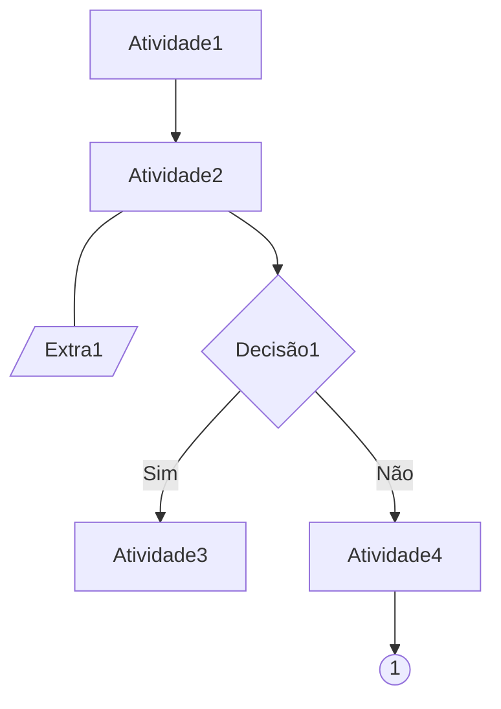
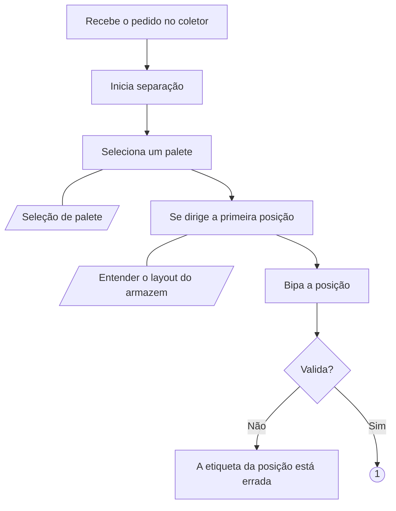
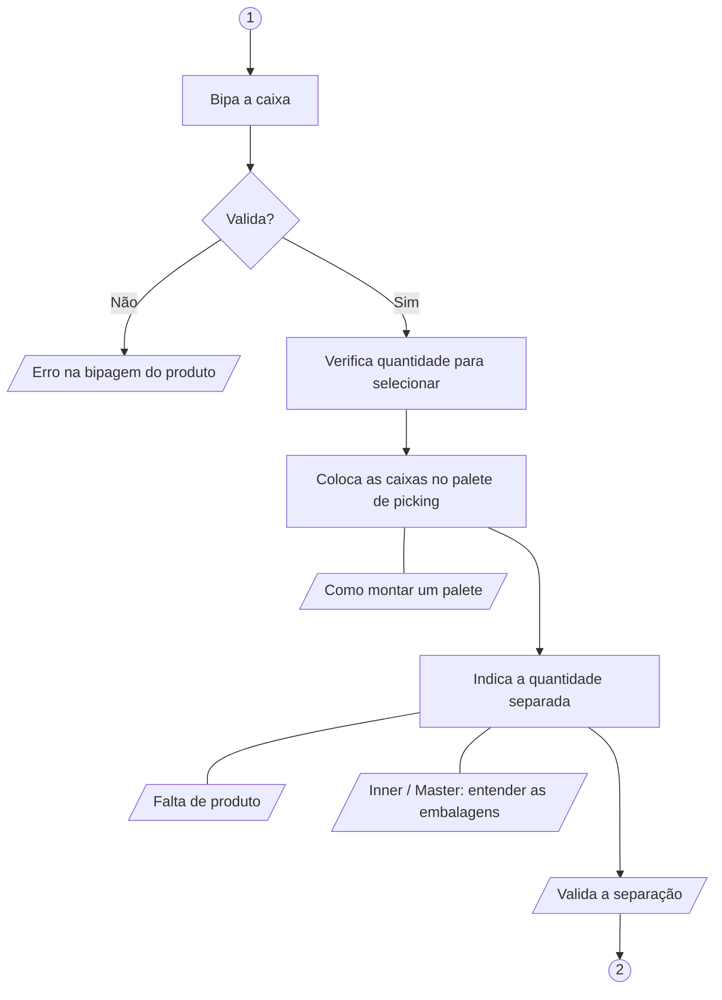
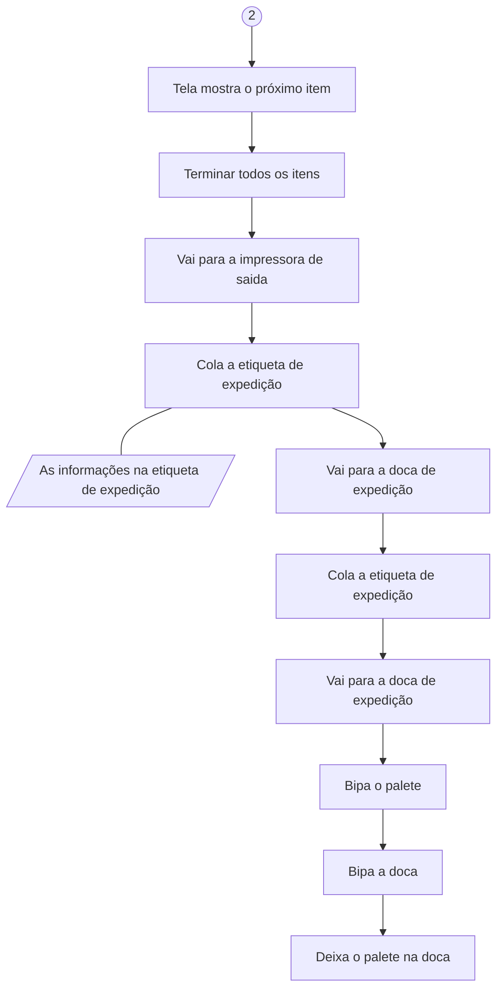

<script src="https://cdn.jsdelivr.net/npm/mermaid/dist/mermaid.min.js"></script>

# Process modeling guide

## Introduction
Supply chain experts need to translate their knowledge into training materials to operational teams. Modeling the processes in question can help a lot with the translation. The 
following document will delineate a procedure to do exactly that.  

## Process variant definition
The first step is to isolate and caracterize the process variant to be mapped. Operational processes can have many flavors. Let's consider the picking as an exemple. Pickings can be done by unit, box or pallet, in batch or by client order. Besides, no matter the conceptual model, the implementation done by each company will differ.

Exemple:
*Process variant*  
- Picking by box and multiple client orders.

## Process flow
The second step is to identify the sequence of activities. At this point, only the activity name and it's connections with the others activities are needed. The modeling should be done using the mermaid syntax.

Segue a syntax a ser utilizada:  
- inicie um bloco de código com ```mermaid
- defina o tipo de gráfico (graph TD).
- Represente cada atividade por uma letra maiúscula, seguida pelo nome que deve aparecer no gráfico entre colchetes [].
- Represente cada extra por uma letra maiúscula, seguida pelo nome que deve aparecer no gráfico entre colchetes e barras [//].
- Represente decisões por uma letra maiúscula, seguida pelo nome que deve aparecer no gráfico entre chaves {}.
- Represente conexões sequencias entre atividades por -->
- Represente conexões entre atividades e extras por ---
- Represente texto nas conexões por --"Texto--> ou --"Texto"---
- Feche o bloco de código com ```
- Limite o número de componentes a 10, por conta da renderização. Se for necessário, quebre o processo em diferentes blocos, utilizando o componente de ligação ((Número_do_link)) para realizar a conexão visual entre diagramas.

Exemple:


## Additional information
Include any information deemed important to understand the process. This information can be at the variant level, or related to one specific activity.
At the process level, use a list (-) to formalize the content. At the activity level, use a table. To make a table, use vertical bar characters to denote cells. Start with column headers, separate with a row of cells with hyphens, then add further rows of cells.

Exemple:

*Overall*
- the picking is performed using a chariot, which ports 2 pallets.
- Each pallet will contains 1 client order.
- Client orders are paired based on the chosen carrier.

*Activities*  

|Activity|Comment|
|:-------|:-------|
|Cola a etiqueta de expedição |A impressora fica próxima da doca 12 |

+++

## Putting all together: Picking by box and multiple client orders.

*Process variant*  
- Picking by box and multiple client orders.

*Overall*
- the picking is performed using a chariot, which ports 2 pallets.
- Each pallet will contains 1 client order.
- Client orders are paired based on the chosen carrier.







*Activities*  

|Activity|Comment|
|:-------|:-------|
|Cola a etiqueta de expedição |A impressora fica próxima da doca 12aa |